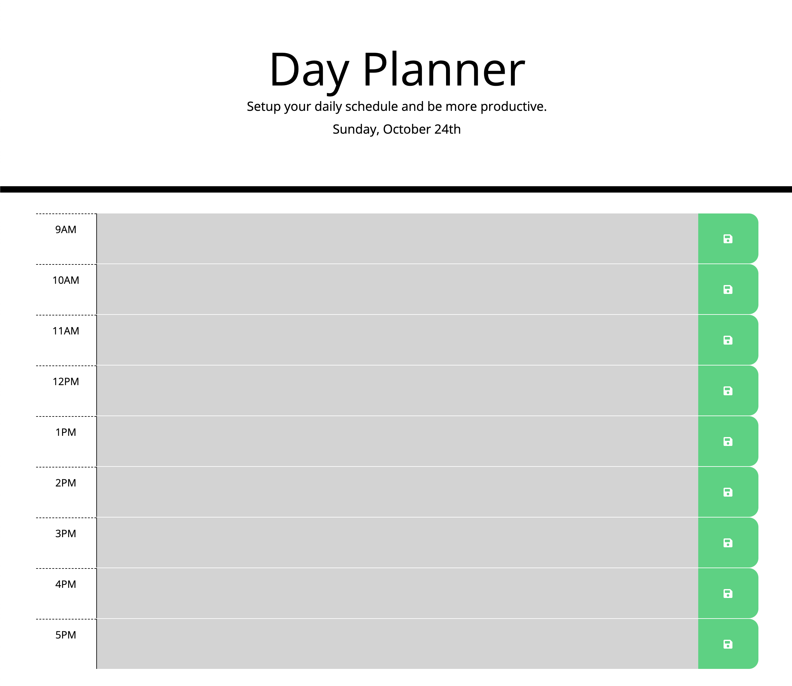

# Presenting: Day Planner App

## Description

For the Day Planner App we are using several frameworks like bootstrap, moment.js and jquerry. The purpose of the App is to let the users organise their working day within this interactive app. Entered Information is beeing saved in the local storage.

## Screenshot

## Relevant Links

Please find the relevant links here:

* Live - App Demo on Github.io: [Click Here](https://alexanderpuschkinberlin.github.io/day-planner-2021/)

* Repository on Github: [Click Here](https://github.com/alexanderpuschkinberlin/day-planner-2021)

- - -
© 2021 Alexander Puschkin | All Rights Reserved.